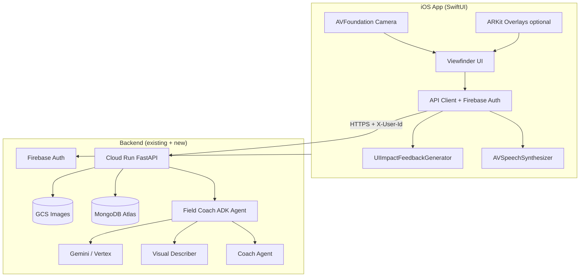
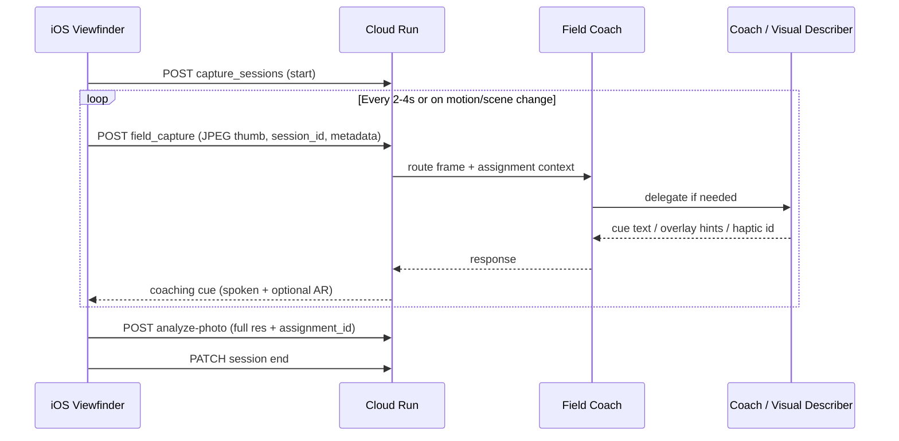

# Iris iOS — End-to-end implementation plan

**Status:** Phase 0 scaffold in repo — open `ios/Iris.xcodeproj` on a Mac with Xcode 15+  
**Date:** May 25, 2026 · **Revised:** May 27, 2026 (design tokens, web Field baseline, live-coaching refinements)  
**Product:** Photography Practice Companion (Iris)  
**Canonical spec:** [`spec.md`](spec.md) §3.4, §4.7, Phase 4+

**Verdict:** Ready to execute — start Phase 0 after prerequisites in §15.

**Scope:** Native iPhone app for **live Field Coach** during camera capture, sharing the same backend as the web studio. Web UI/UX is frozen; this track is independent of hackathon timeline.

**Product split:**

| Surface | Role |
|--------|------|
| **Web (frozen)** | Studio — portfolio, Glass Box critique, Practice assignments, Mentor chat |
| **iPhone (this plan)** | Viewfinder companion — real-time coaching while shooting |

---

## Table of contents

1. [What exists today vs what iOS needs](#1-what-exists-today-vs-what-ios-needs)
   - [Web Field / Shoot Now today](#web-field--shoot-now-today-baseline-for-ios-phase-1)
2. [Strategic decisions](#2-strategic-decisions-lock-these-first)
3. [Target user journeys](#3-target-user-journeys-ios)
4. [System architecture](#4-system-architecture-end-to-end)
5. [Phased roadmap](#5-phased-roadmap-post-hackathon-friendly)
6. [iOS app structure](#6-ios-app-structure-modules)
7. [Live coaching rules](#7-live-coaching--product--technical-rules)
8. [Backend work checklist](#8-backend-work-checklist-parallel-track)
9. [Design and brand](#9-design--brand-frozen-web--ios)
10. [Security, privacy, compliance](#10-security-privacy-compliance)
11. [Risks and mitigations](#11-risks--mitigations)
12. [Effort estimates](#12-effort--team-rough)
13. [Success metrics](#13-success-metrics)
14. [Recommended execution order](#14-recommended-execution-order-summary)
15. [Decisions before Phase 0](#15-decisions-for-you-before-phase-0)

---

## 1. What exists today vs what iOS needs

### Already in production (reuse as-is)

- **Auth:** Firebase Google sign-in → API via `X-User-Id` (uid mapped to MongoDB in `app/memory/user_ids.py`)
- **Post-capture critique:** `POST /api/v1/analyze-photo` (Coach pipeline, GCS, portfolio, optional `assignment_id`)
- **Practice:** assignments propose / accept / complete / active
- **Mentor:** `POST /api/v1/agent/chat`
- **Agents (server):** Field Coach (`app/sub_agents/field_coach.py`), Visual Describer, Coach, Mentor — persona filtering in orchestrator
- **Data:** MongoDB (`portfolio_entries`, `users`, `capture_sessions` tooling exists in Field Coach tools)
- **Web Field (bridge):** `getUserMedia` → one shot → `analyze-photo` — **not** live coaching

### Spec'd but not wired for mobile

| Contract (`docs/spec.md` §4.7) | Status |
|--------------------------------|--------|
| `POST /v1/capture_sessions` | No REST; session logic in Field Coach **tools** only |
| `POST /v1/agent/field_capture` | **Not implemented** — core gap for live coaching |
| `POST /v1/agent/field_voice` | **Not implemented** |
| `POST /v1/portfolio` (capture-to-library) | Partially covered by `analyze-photo` today |
| Haptics delivery | Stub (`delivered: false`, “iOS Phase 4”) |

**Implication:** iOS v1 can ship **capture-then-analyze** quickly (parity with web Field). **Live coaching** requires a dedicated backend phase plus native camera/audio/haptics loop.

### Web Field / Shoot Now today (baseline for iOS Phase 1)

Field is **not** a top-level tab on web — it is a **sub-view inside Practice** (`App.tsx`: `practiceView === 'field'`). Legacy `#field` hashes redirect to `#practice`.

| Step | Web behavior |
|------|----------------|
| Assignment | Practice → Propose → Accept → `GET /api/v1/assignments/active` |
| Entry | Inline banner **Field** / **Studio**, or active card **Field (camera)**; Home **Shoot Now** opens Practice **list** (does not auto-open Field) |
| Capture | `FieldTab.tsx`: `getUserMedia` (rear ~1280×720), rule-of-thirds CSS overlay |
| Shutter | Canvas → JPEG → `POST /api/v1/analyze-photo` with `assignment_id` (Coach — **not** Field Coach agent) |
| Fallback | Gallery / `capture="environment"` if no camera or HTTP |
| After | User returns to Practice → **Mark complete** → reflection |

**Not on web:** `field_capture` streaming, voice, haptics, `capture_sessions` REST.

**iOS Phase 1 target:** Same API contract and assignment loop; native AVFoundation instead of `getUserMedia`. **iOS Phase 3+:** Live coaching via `field_capture`. Consider deep link `practice → field` (web Home does not auto-open Field).

---

## 2. Strategic decisions (lock these first)

| Decision | Recommendation | Why |
|----------|----------------|-----|
| **Native vs Capacitor** | **SwiftUI + AVFoundation** | AR overlays, low-latency camera, `AVSpeechSynthesizer`, `UIImpactFeedbackGenerator` — product differentiator |
| **Capacitor** | Fallback only | ~1 week to wrap PWA; **no** live AR/voice/haptics quality |
| **Same API host** | Yes — Cloud Run + Firebase | One user, one portfolio; web + iOS |
| **Live coaching v1** | **Throttled frames + short audio/text cues**, not 30 FPS full Coach | Cost, latency, battery |
| **Offline** | Phase 2+ | Queue uploads + “coaching paused” UX; don’t block App Store v1 |
| **Bundle ID** | `com.prasadtilloo.practicecompanion` (per `ios/README.md`) | Keep continuity |

**Prerequisites (manual):** Mac, Xcode 15+, Apple Developer Program ($99/yr), privacy policy URL, App Store screenshots/copy.

---

## 3. Target user journeys (iOS)

### Journey A — Hobbyist / Working pro (sighted)

1. Sign in (Firebase) → persona from `GET/PATCH /api/v1/users/me`
2. Open **Practice** → see active assignment (or prompt to accept on web / in-app later)
3. **Field** → start capture session → live viewfinder
4. While framing: periodic coaching (composition, light, subject) — **muted / minimal UI** on screen
5. **Shutter** → full critique via Coach (existing or enhanced endpoint) → saved to portfolio, linked to assignment
6. Optional: open **Mentor** tab for chat; deep portfolio review still fine on web

### Journey B — Vision impairment

1. Same auth + assignment context
2. **Voice-first** Field: scene description, spatial hints (“subject left of center”)
3. **Haptics** for confirm / warning patterns (client executes; server returns pattern id)
4. Voice HITL: confirm before portfolio write / session end
5. Session end → auditory summary (`intent=narrate_session` in spec)

### Journey C — Working pro (stretch)

- Push when assignment accepted
- Quick link to Print/Triage — **web-first** until native screens exist

---

## 4. System architecture (end-to-end)

### Live coaching loop (target)

---

## 5. Phased roadmap (post-hackathon friendly)

### Phase 0 — Foundation (1–2 weeks)

**Goal:** App on device talking to prod API; no live coach yet.

| Workstream | Tasks |
|------------|--------|
| **Apple** | Xcode project, signing, capabilities (Camera, Photo Library, Microphone if voice) |
| **Auth** | Firebase iOS SDK → same project as web → attach `X-User-Id` on every request |
| **API client** | Base URL from config; mirror web headers; error handling |
| **Shell UI** | Tab bar aligned with web IA: **Field** (primary), **Practice**, **Mentor**, **Settings** (skip Print v1 or deep-link to web) |
| **CI** | Fastlane or Xcode Cloud for TestFlight builds |

**Exit:** TestFlight internal build; sign-in; health check.

---

### Phase 1 — Field v1: capture-then-analyze (2–3 weeks)

**Goal:** App Store–worthy **single-shot** flow (matches web Field, better camera).

| iOS | Backend |
|-----|---------|
| AVFoundation preview (rear camera, exposure lock optional) | **No change** if using existing `POST /api/v1/analyze-photo` |
| Rule-of-thirds overlay (UIKit/SwiftUI, not ARKit yet) | |
| Require active assignment (`GET /api/v1/assignments/active`) | |
| Shutter → compress JPEG → multipart upload | |
| Results screen: scores + Glass Box summary (read-only) | |
| “Mark complete” → `POST .../complete` or deep link to web Practice | |

**Exit:** User can complete a Practice assignment entirely on phone **without** live cues.

---

### Phase 2 — Backend: live Field Coach API (2–3 weeks)

**Goal:** Implement spec contracts the web never needed.

| Endpoint | Behavior |
|----------|----------|
| `POST /api/v1/capture_sessions` | Create session doc: `user_id`, `assignment_id`, `persona`, `started_at`, device metadata |
| `POST /api/v1/agent/field_capture` | Accept: `session_id`, frame (image or base64), optional `frame_index`, `trigger` (timer / tap / motion) |
| Response schema | `spoken_cue`, `on_screen_hint`, `overlay` (grid/horizon/subject box JSON), `haptic_pattern`, `confidence`, `mute_suggested` |
| `POST /api/v1/agent/field_voice` | Audio or transcript + session context → Field Coach |
| Session end | Update session; optional `invoke` narrate for VI persona |

**Server logic:**

- Wire HTTP handlers to existing **Field Coach** agent (not bypass to raw Coach).
- **Throttle:** server-side rate limit per session (e.g. max 1 inference / 3s unless user taps “help now”).
- **Frame policy:** client sends 512–768px JPEG ~50–80KB; full resolution only on shutter.
- **Idempotency:** `session_id` + `frame_index` to dedupe retries.
- **Logging:** trace id per session for debug (Arize optional later).

**Exit:** Postman/curl can drive `field_capture` with a test image; Field Coach returns structured cues.

---

### Phase 3 — iOS live coaching (3–5 weeks)

**Goal:** Real-time assistance during capture. *Solo part-time: treat 3–4 weeks as optimistic; quality tuning often adds 1–2 weeks.*

| Component | Detail |
|-----------|--------|
| **Session warm-up** | `POST /capture_sessions` when Field tab opens (not on first frame) — saves ~200ms perceived latency on first cue |
| **Frame pipeline** | `AVCaptureVideoDataOutput` → resize → encode → upload on timer + “Ask Iris” |
| **Adaptive frame policy** | Wi‑Fi → up to 768px JPEG; cellular → ~512px; Low Power Mode → pause API coaching, local overlays only |
| **Local fallbacks (Core ML)** | On-device horizon tilt + rule-of-thirds grid **without** API — app stays responsive on poor connectivity; server cues augment, not replace, basics |
| **Cue presentation** | Short `AVSpeechUtterance` (respect mute switch); subtitle strip; optional ARKit overlay from JSON |
| **Cue deduplication** | Client: do not speak the same cue text twice within 30s (server may repeat) |
| **ARKit (sighted v1)** | Horizon line, thirds grid, subject box from server JSON — not full SLAM |
| **Battery / thermal** | Pause when backgrounded; reduce coaching rate on low power / thermal pressure — **target under 8% battery per 15‑min Field session** on iPhone 14+ class devices (measure in TestFlight) |
| **HITL** | Mute coach; “ignore”; voice speed; confirm before portfolio write (VI) |

**Exit:** Demoable “coach in your ear while you frame” for sighted + basic VI voice path.

#### Phase 3b — Transport (if REST latency blocks “live” feel)

| Approach | When |
|----------|------|
| **REST** (default) | One `field_capture` per glance; simple to ship |
| **SSE** | Server pushes cues when inference completes; drops per-request connection overhead (~300–500ms) |
| **WebSocket** | Bidirectional frames + cues; only if SSE insufficient |

Start REST in Phase 2; add SSE/WebSocket in 3b if median cue latency stays above 4s after warm-up and frame policy tuning.

---

### Phase 4 — Vision impairment depth (2–3 weeks)

| Feature | Implementation |
|---------|----------------|
| Voice-only UI mode | Large controls, VoiceOver labels, minimal visual dependency |
| Haptics | Map server `haptic_pattern` → `UIImpactFeedbackGenerator` / Core Haptics |
| `field_voice` | Hold-to-talk or hands-free with VAD (Apple Speech framework → text → API) |
| Session narration | End session → orchestrator `narrate_session` → speak summary |
| Accessibility review | Test with VoiceOver users; WCAG-aligned contrast on any visible UI |

---

### Phase 5 — Polish and App Store (2–3 weeks)

| Area | Tasks |
|------|--------|
| **TestFlight beta** | Recruit **5–10 working photographers / serious hobbyists**; script: accept assignment → Field session → shutter → complete; capture latency, cue usefulness, battery |
| **Onboarding** | Link to web for portfolio history; explain Field vs Studio |
| **Push** | FCM + APNs: assignment proposed, critique ready |
| **Privacy** | Camera/mic usage strings; data retention; export/delete account |
| **App Review** | No medical claims; clear “mentor not doctor”; photography education positioning |
| **Performance** | Cold start, memory on long sessions |
| **Analytics** | Firebase Analytics or privacy-preserving events (session length, cues accepted) |

**Exit:** App Store submission after at least one TestFlight feedback round.

---

### Phase 6 — Stretch (ongoing)

- Offline queue for uploads + cached last cues
- Apple Watch complication (“open assignment”)
- Live Activities for “coaching active”
- Pro: quick triage approve from phone
- Deeper Core ML (subject saliency, level detection) to further reduce API calls
- watchOS / iPad layouts

---

## 6. iOS app structure (modules)

Suggested Xcode targets / Swift packages:

| Module | Responsibility |
|--------|----------------|
| **App** | SwiftUI shell, navigation, deep links (`iris://practice`, `iris://field`) |
| **Auth** | Firebase Auth, token → `X-User-Id` |
| **Networking** | `APIClient`, multipart upload, streaming responses if you add SSE later |
| **Practice** | Assignments list/active, accept/decline (or web handoff) |
| **Field** | Camera session, coaching loop, shutter → analyze |
| **Mentor** | Chat UI (reuse API like web) |
| **DesignSystem** | Warm amber tokens from production `frontend/src/index.css` — don’t redesign, **translate** |
| **Accessibility** | VoiceOver, haptics, speech queue |
| **Models** | Codable DTOs shared with OpenAPI spec (generate from FastAPI later) |

**Deep linking with web:** Same hash routes (`#work`, `#practice`) can open web for portfolio grid; app handles `field` and `mentor`.

---

## 7. Live coaching — product and technical rules

### What “live” means (v1 contract)

- **Not** continuous Gemini on 30 FPS video.
- **Yes** periodic “coach glances” + user-triggered “help now” + full critique on shutter.

### Client triggers for `field_capture`

| Trigger | When |
|---------|------|
| Timer | Every 3–4 s while viewfinder active (configurable) |
| Motion | Accelerometer / scene change heuristic (optional Phase 3b) |
| User | Tap “Ask Iris” |
| Pre-shutter | 1 s before capture (optional “last check”) |

### Cue budget (UX)

- Max **one spoken sentence** per response (~15 words).
- On-screen: **one** primary hint (e.g. “Move left — subject centered”).
- Avoid stacking cues; queue on client if responses overlap.

### Cost control

- Cap sessions at e.g. 15 min or 120 frames/session.
- Downgrade to local-only overlays if API errors (Core ML grid/horizon + no LLM).

---

## 8. Backend work checklist (parallel track)

Ordered by dependency:

1. **OpenAPI / contract doc** for `field_capture` request/response (single source for iOS + FastAPI).
2. **`POST /api/v1/capture_sessions`** — REST wrapper around existing Mongo `capture_sessions`.
3. **`POST /api/v1/agent/field_capture`** — authenticate, validate session, call Field Coach with frame + persona + assignment brief.
4. **Response normalizer** — stable JSON for iOS (speech text, overlay, haptic enum).
5. **`field_voice`** — transcript in, same agent path.
6. **Rate limits and quotas** per user/session.
7. **Integration tests** — sighted vs `vision_impairment` persona tool lists (`test_persona_isolation.py` pattern).
8. **CORS** — not needed for iOS; ensure API accepts mobile User-Agent if you add WAF rules.
9. **Transport (Phase 3b):** Start REST; add **SSE** (server-push cues) or **WebSocket** if median latency stays above 4s after client warm-up.

**Web Field:** Can stay on `analyze-photo` forever, or later adopt `field_capture` for parity.

### REST vs SSE (architecture note)

| Transport | Pros | Cons |
|-----------|------|------|
| **REST** | Simple, debuggable, matches existing FastAPI patterns | New connection + request overhead per frame (~300–500ms) |
| **SSE** | Persistent connection; server pushes cue when ready | One-way; still upload frames via POST or multipart side channel |
| **WebSocket** | Full duplex | More infra complexity, reconnect logic |

Recommendation: **REST for Phase 2–3a**; prototype **SSE cue stream** in 3b if judges/users report “sluggish coach.”

---

## 9. Design and brand (frozen web → iOS)

Production web uses the **warm darkroom / amber** palette (not the abandoned “Analog Ink & Paper” experiment). Port tokens from [`frontend/src/index.css`](../frontend/src/index.css):

| Role | Token | Hex |
|------|--------|-----|
| Canvas | `--color-canvas` | `#1a1816` |
| Surfaces | `--color-surface-1` … `3` | `#2a2724` … `#3d3834` |
| Borders | `--color-warm-border` | `#44403c` |
| Accent | `--color-brand-400` / `500` | `#fbbf24` / `#f59e0b` |
| Accent dark | `--color-brand-600` / `700` | `#d97706` / `#b45309` |
| Body text | (CSS) | `#e7e5e4` / stone scale |
| Typography | DM Sans (body), Newsreader (headlines) | same as web |

**Brand / logo (shipped):**

- Copy: [`frontend/src/config/brand.ts`](../frontend/src/config/brand.ts) — `BRAND.name`, `taglineShort` (“The mentor who remembers”).
- Mark: [`frontend/src/components/IrisMark.tsx`](../frontend/src/components/IrisMark.tsx) → `frontend/public/iris-icon.png` (transparent PNG).
- Rules: [`brand-logo-brief.md`](brand-logo-brief.md).

**iOS:** Use same colors and wordmark strings; App Icon from `iris-icon-512.png`. Viewfinder UI: **minimal chrome** — full-bleed preview; cues in bottom sheet with `surface-1` + amber accent (match web `FieldTab` / Glass Box tone). Do **not** fork a second design system.

---

## 10. Security, privacy, compliance

| Topic | Approach |
|-------|----------|
| **Images in transit** | HTTPS only; TLS pinning optional later |
| **Images at rest** | GCS + MongoDB (existing); session frames: short TTL or don’t persist thumbs unless user captures |
| **Auth** | Firebase; no API keys in binary |
| **App Store Privacy Nutrition** | Photos, User ID, Usage data — declare coaching/ML |
| **Children** | 17+ or no kids targeting if UGC photos |
| **Location** | Avoid until needed; EXIF strip on upload if privacy-sensitive |

---

## 11. Risks and mitigations

| Risk | Mitigation |
|------|------------|
| Latency > 3s kills “live” feel | Session warm-up on Field open; Core ML grid/horizon offline; “thinking” haptic; SSE in 3b if needed |
| API cost per session | Frame caps; smaller model for field glances vs full Coach on shutter |
| App Review rejection (camera background) | Clear usage descriptions; no hidden recording |
| Field Coach agent not exercised in prod | Phase 2 integration tests + one scripted demo session |
| Scope creep (full web on iOS) | v1 = Field + Practice active + Mentor lite; portfolio grid web/deep link |
| Logo/color drift | Single token file shared doc between web and iOS |

---

## 12. Effort and team (rough)

| Phase | Calendar (focused part-time) |
|-------|------------------------------|
| 0 Foundation | 1–2 weeks |
| 1 Capture-then-analyze | 2–3 weeks |
| 2 Backend live API | 2–3 weeks |
| 3 iOS live coaching | 3–5 weeks |
| 4 VI depth | 2–3 weeks |
| 5 App Store (+ TestFlight beta) | 2–3 weeks |
| **Total to compelling live coach + store** | **~12–20 weeks** part-time |

**Note:** 12–18 weeks is realistic for **Phase 0–2 + Phase 1** (parity + API). **Live coaching quality** (Phase 3–4) often slips +2–4 weeks for solo devs — budget accordingly.

Capacitor-only shell: subtract ~8 weeks of native work but **drop** live coaching quality.

---

## 13. Success metrics

| Milestone | Metric |
|-----------|--------|
| Phase 1 | 10 TestFlight users complete assignment on phone |
| Phase 3 | Median cue latency < 4s; >70% sessions get ≥1 cue before shutter |
| Phase 4 | VI tester completes session voice-only |
| TestFlight | 5–10 photographers; NPS or “would use again” ≥7/10 |
| App Store | Crash-free sessions > 99%; 4.0+ rating on “helpful coaching” |

---

## 14. Recommended execution order (summary)

1. **Phase 0–1** — Ship TestFlight with native camera + `analyze-photo` (validates auth, API, Practice loop).
2. **Phase 2** — Backend `field_capture` + sessions (unblocks real differentiation).
3. **Phase 3** — Live viewfinder coaching + speech.
4. **Phase 4** — Vision impairment + haptics + voice commands.
5. **Phase 5** — App Store + push + privacy.

Web stays the **studio**; iOS becomes the **viewfinder** — aligned with `docs/spec.md` §3.4.

---

## 15. Decisions for you (before Phase 0)

1. **Mac + Apple Developer** — enrolled and ready?
2. **v1 App Store scope** — Field + Practice only, or Mentor chat in v1 too?
3. **Live coaching in v1.0** — ship capture-then-analyze first (2–3 weeks earlier), or wait for Phase 2 API?
4. **Vision impairment** — launch sighted first, or parallel from Phase 4?
5. **OpenAPI** — generate iOS models from FastAPI now to avoid drift?

---

## Related docs

| Document | Link |
|----------|------|
| Master spec (iOS §3.4, routing §4.7) | [`spec.md`](spec.md) |
| iOS placeholder | [`../ios/README.md`](../ios/README.md) |
| UI/UX (web canonical) | [`ui-ux-design.md`](ui-ux-design.md) |
| Brand / logo | [`brand-logo-brief.md`](brand-logo-brief.md) |
| Deploy / API base URL | [`deploy.md`](deploy.md) |
| Doc index | [`doc-map.md`](doc-map.md) |
